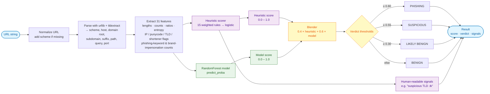
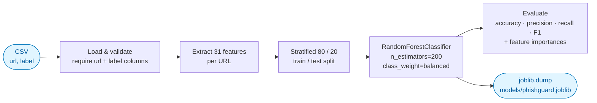

# PhishGuard — Phishing URL Classifier

A hybrid phishing-URL detector that combines hand-crafted heuristic rules with a
machine-learning classifier (scikit-learn `RandomForest`). Given any URL, it
returns a phishing-likelihood score between 0.0 (benign) and 1.0 (almost
certainly phishing), plus a human-readable explanation of the signals that
contributed to the decision.

## Why hybrid?

- **Heuristics** catch the obvious stuff instantly and require no training data.
  Things like raw-IP hosts, punycode, `@` in the authority, suspicious TLDs, and
  brand-keyword stuffing are easy wins.
- **ML model** learns the subtle statistical patterns heuristics miss (token
  distributions, entropy, character-class ratios, etc.) once you feed it
  labelled data.

The CLI returns the heuristic score, the model score, and a blended verdict.

## How it works

### Inference dataflow

When you call `classify(url)` (or `phishguard scan <url>`), the URL travels
through the pipeline below. The heuristic scorer and the ML model run on the
**same** feature vector and their scores are blended into a single verdict.



If no trained model is available, the pipeline gracefully degrades to the
heuristic score alone — you still get a useful verdict, just without the
statistical layer.

### Training dataflow

`phishguard train --data <csv>` runs this pipeline once to produce a
serialized model that the inference path can load.



### Module map

| Module | Responsibility |
| --- | --- |
| `phishguard.features` | URL parsing + 31-feature extraction (pure, no I/O) |
| `phishguard.heuristics` | Weighted rule scorer + signal explanations |
| `phishguard.model` | scikit-learn wrapper: train, save, load, predict |
| `phishguard.classifier` | High-level `classify()` that blends the two |
| `phishguard.cli` | `phishguard` command (`scan` / `train` / `features`) |

## Features extracted

Lexical / structural:

- URL, hostname, path, query lengths
- Counts of `.`, `-`, `/`, `?`, `=`, `&`, `@`, digits, special chars
- Digit ratio, letter ratio, special-char ratio
- Shannon entropy of hostname and full URL
- Number of subdomains, longest token length

Host signals:

- Hostname is a raw IPv4 / IPv6 address
- Punycode (`xn--`) present
- Uses non-standard port
- TLD is on a suspicious list (e.g. `.zip`, `.tk`, `.cf`, `.gq`, `.ml`)
- Known URL-shortener domain

Content signals:

- Phishing keywords (`login`, `verify`, `secure`, `account`, `update`, `bank`, …)
- Brand impersonation tokens (`paypal`, `apple`, `microsoft`, …) outside the
  registered domain
- Hex-encoded characters in path / query
- Double slashes after the scheme

## Quick start

```bash
# 1. Install (editable mode is handy while you're iterating)
pip install -e .

# 2. Train the model on the bundled seed dataset
phishguard train --data data/seed_dataset.csv --out models/phishguard.joblib

# 3. Score a URL
phishguard scan "http://paypa1-login.security-update.tk/verify?id=42"

# 4. After training
phishguard scan "http://paypa1-login.security-update.tk/verify?id=42" --model models/phishguard.joblib
```

Sample output:

```
URL: http://paypa1-login.security-update.tk/verify?id=42
Heuristic score : 0.82  (HIGH)
Model score     : 0.91  (HIGH)
Blended verdict : 0.87  PHISHING

Top signals:
  + suspicious TLD (.tk)
  + phishing keyword in path: 'verify'
  + brand impersonation token outside registered domain: 'paypal'
  + high hostname entropy (3.71)
  + uses HTTP, not HTTPS
```

## Library usage

```python
from phishguard import classify

result = classify("http://paypa1-login.security-update.tk/verify?id=42")
print(result.score, result.verdict, result.signals)
```

## Training on your own data

The trainer accepts a CSV with two columns: `url`, `label` (1 = phishing,
0 = benign). Public datasets that work out of the box:

- [PhishTank](https://www.phishtank.com/developer_info.php) (phishing samples)
- [Tranco list](https://tranco-list.eu/) (benign top sites)
- [Mendeley phishing dataset](https://data.mendeley.com/datasets/h3cgnj8hft)

```bash
phishguard train --data path/to/your.csv --out models/phishguard.joblib
```

## Project layout

```
phishing-url-classifier/
├── src/phishguard/
│   ├── __init__.py        # public API: classify(), Result
│   ├── features.py        # URL feature extraction
│   ├── heuristics.py      # rule-based scorer + signal explanations
│   ├── model.py           # scikit-learn wrapper (train / load / predict)
│   ├── cli.py             # `phishguard` command
│   └── data.py            # dataset loading helpers
├── data/seed_dataset.csv  # tiny labelled dataset to bootstrap training
├── tests/                 # pytest suite
├── pyproject.toml
└── requirements.txt
```

## Disclaimer

This tool is for **defensive research and education**. It will produce false
positives and false negatives. Do not use it as the sole gate for blocking
traffic in production. Pair it with reputation feeds (Google Safe Browsing,
PhishTank, etc.) and human review.
